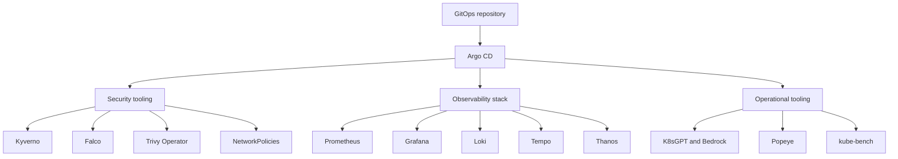
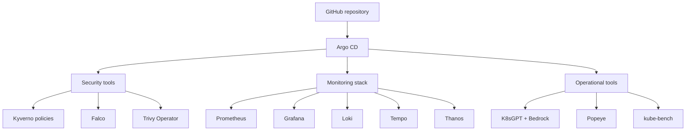

# Say When: EKS GitOps Platform

This repository contains the declarative Kubernetes and GitOps configuration for my AWS EKS home lab. It documents my hands-on work with Kubernetes security, observability, policy enforcement, AI-assisted operations, and platform engineering.

The supporting AWS infrastructure is provisioned separately with Terraform in the `say_when_infra` repository.

For walkthroughs, screenshots, and lessons learned, visit:

[im-your-huckleberry.com](https://im-your-huckleberry.com/)

> This is a cost-conscious learning environment and portfolio project. It is not intended to be a production-ready reference architecture without additional hardening.

IF your more of "lemme see the sausage making process", feel free to parooze in this repo where i post a plethora of code around. Now I know what your thinking, what actually will this repo & blog do for me when i click it? Well put it like this as a once great 21st century philospher before me once said:
- Wyatt Earp - "you tell em i'm coming & hells coming w/me!"
- Matt Foley - "im gonna be your shadow, were gonna be pals! were gonna wrestle around w/each-other!"
- Bane - "i was born in the dark.."
- Justin Gaethje - "people recongize max effort"

## Architecture



## Repository structure

```text
.
├── applications/              # Argo CD Application resources
├── apps/                      # Helm values and Kubernetes manifests
│   ├── falco/
│   ├── k8sgpt/
│   ├── k8sgpt-operator/
│   ├── kube-bench/
│   ├── kube-prometheus-stack/
│   ├── kyverno/
│   ├── loki/
│   ├── metrics-server/
│   ├── network-policies/
│   ├── popeye/
│   ├── tempo/
│   ├── thanos/
│   └── trivy-operator/
├── bootstrap/                 # Argo CD root/bootstrap resources
└── docs/                      # Supporting documentation and examples
```

## Platform components

### GitOps

- Argo CD
- App-of-apps deployment model
- Automated synchronization
- Self-healing and pruning
- Helm charts with Git-managed values
- Sync waves for dependency ordering

### Policy and security

- Kyverno CEL-based

Below are complete, portfolio-ready replacements for both README files. They preserve your personality while making the projects easier for employers and other engineers to understand.

## GitOps README

Replace `say_when_git_ops/README.md` with:

````markdown
# Say When GitOps

A GitOps repository for my AWS EKS DevSecOps home lab.

This project documents my hands-on journey with Kubernetes, GitOps, cloud security, policy enforcement, observability, and AI-assisted operations. The configurations are designed for a small, cost-conscious learning environment rather than a production deployment.

For walkthroughs, screenshots, and explanations, visit my blog:

[I'm Your Huckleberry](https://im-your-huckleberry.com/)

## Architecture



Terraform creates the AWS infrastructure and installs Argo CD. Argo CD then reconciles the Kubernetes applications and configuration stored in this repository.

The related infrastructure repository is:

[Say When Infrastructure](https://github.com/earpjennings37/say_when_infra)

## Repository structure

```text
.
├── applications/                 # Argo CD Application resources
├── apps/
│   ├── falco/                    # Runtime threat detection
│   ├── k8sgpt/                   # K8sGPT analyzer configuration
│   ├── k8sgpt-operator/          # K8sGPT Operator Helm values
│   ├── kube-bench/               # CIS benchmark CronJob and RBAC
│   ├── kube-prometheus-stack/    # Prometheus and Grafana values
│   ├── kyverno/                  # Kyverno values and CEL policies
│   ├── loki/                     # Log-storage configuration
│   ├── metrics-server/           # Kubernetes Metrics Server
│   ├── network-policies/         # Monitoring NetworkPolicies
│   ├── popeye/                   # Cluster linting CronJob and RBAC
│   ├── tempo/                    # Trace-storage configuration
│   ├── thanos/                   # Long-term metrics configuration
│   └── trivy-operator/           # Vulnerability scanning
├── bootstrap/                    # Root Argo CD bootstrap resources
├── docs/                         # Local-tool configuration examples
└── README.md
```

## Applications

| Component | Purpose |
|---|---|
| Argo CD | Continuously reconciles the cluster with Git |
| Kyverno | Applies CEL-based Kubernetes policy controls |
| Falco | Detects suspicious runtime activity |
| Trivy Operator | Scans Kubernetes workloads and images |
| K8sGPT | Analyzes Kubernetes issues using Amazon Bedrock |
| kube-bench | Runs CIS Kubernetes benchmark checks |
| Popeye | Identifies Kubernetes configuration problems |
| Prometheus | Collects and stores metrics |
| Grafana | Provides dashboards and data-source access |
| Loki | Stores Kubernetes logs |
| Tempo | Stores distributed traces |
| Thanos | Adds S3-backed long-term metrics capabilities |
| Metrics Server | Supplies Kubernetes resource metrics |

## Argo CD deployment model

The repository uses an app-of-apps pattern:

1. Terraform installs Argo CD.
2. Terraform applies the root bootstrap Application.
3. Argo CD discovers the Application manifests under `applications/`.
4. Each Application deploys either an upstream Helm chart or manifests from this repository.
5. Automated synchronization provides drift correction and pruning.

Applications use sync waves where ordering is important. For example, Kyverno is installed before its policy resources.

## Kyverno policies

The repository uses the newer CEL-based Kyverno policy APIs under:

```text
policies.kyverno.io/v1
```

Current policies include:

| Policy | Action |
|---|---|
| Disallow images using `latest` or no tag | Deny |
| Disallow privilege escalation | Deny |
| Disallow privileged containers | Audit |
| Disallow host namespaces | Audit |
| Require application labels | Audit |
| Require resource requests and limits | Audit |
| Require non-root execution | Audit |
| Require dropping Linux capabilities | Audit |

Policies begin in `Audit` where compatibility must be evaluated before moving them to `Deny`.

## NetworkPolicies

The `monitoring` namespace uses default-deny policies with explicitly allowed communication paths, including:

- Grafana to Prometheus
- Grafana to Loki
- Grafana to Tempo
- Prometheus internal scraping
- Prometheus to kube-state-metrics
- Prometheus to node-exporter
- Prometheus and Thanos communication
- Loki internal communication
- Kubernetes DNS
- Kubernetes API access where required

These policies are intended to demonstrate workload segmentation and least-privilege network access.

## Monitoring configuration

The monitoring stack is intentionally configured in a low-cost mode:

- One Prometheus replica
- 24-hour local retention
- Small EBS volumes
- Loki single-binary deployment
- Tempo local ephemeral storage
- Alertmanager disabled
- Thanos Store Gateway enabled
- Thanos Compactor disabled
- ClusterIP services instead of public load balancers

These settings are appropriate for a temporary home lab, not a production baseline.

## Grafana credentials

Grafana reads its administrator credentials from this Kubernetes Secret:

```text
grafana-admin-credentials
```

The real password is deliberately not committed to Git.

After creating or rebuilding the cluster, wait for the `monitoring` namespace and create the Secret:

```bash
kubectl wait \
  --for=jsonpath='{.status.phase}'=Active \
  namespace/monitoring \
  --timeout=300s

read -rsp 'Grafana admin password: ' GRAFANA_PASSWORD
echo

kubectl create secret generic grafana-admin-credentials \
  --namespace monitoring \
  --from-literal=admin-user=admin \
  --from-literal=admin-password="$GRAFANA_PASSWORD" \
  --dry-run=client \
  -o yaml |
kubectl apply -f -

unset GRAFANA_PASSWORD
```

The Secret must be recreated whenever the EKS cluster is completely destroyed and rebuilt.

Future improvement: manage the credential with AWS Secrets Manager and External Secrets Operator.

## Access Grafana

```bash
kubectl port-forward \
  service/kube-prometheus-stack-grafana \
  --namespace monitoring \
  3000:80
```

Open:

```text
http://localhost:3000
```

## Validation

Check Argo CD applications:

```bash
kubectl get applications -n argocd
```

Check workloads:

```bash
kubectl get pods -A
```

Check Kyverno policies:

```bash
kubectl get validatingpolicies.policies.kyverno.io
```

Check policy reports:

```bash
kubectl get policyreports -A
```

Check monitoring services:

```bash
kubectl get services,endpointslices \
  --namespace monitoring
```

Check NetworkPolicies:

```bash
kubectl get networkpolicies -A
```

## Local manifest validation

Render the primary Helm releases before committing changes:

```bash
helm template kyverno \
  kyverno/kyverno \
  --version 3.9.1 \
  --namespace kyverno \
  --values apps/kyverno/values.yaml \
  >/dev/null
```

```bash
helm template kube-prometheus-stack \
  prometheus-community/kube-prometheus-stack \
  --version 87.21.0 \
  --namespace monitoring \
  --values apps/kube-prometheus-stack/values.yaml \
  >/dev/null
```

```bash
helm template tempo \
  grafana/tempo \
  --version 1.7.0 \
  --namespace monitoring \
  --values apps/tempo/values.yaml \
  >/dev/null
```

## Security considerations

This repository intentionally does not store:

- AWS access keys
- Bedrock API keys
- Grafana passwords
- kubeconfig files
- Terraform state
- Private keys
- Static S3 credentials

AWS workloads use IAM Roles for Service Accounts where applicable. Configuration such as AWS account IDs, role ARNs, regions, and bucket names may be visible, but these values are not authentication credentials.

Some controls are relaxed to reduce cost and complexity in the lab. Review all values before adapting this repository for production.

## AI-assisted operations

This lab includes:

- K8sGPT using Amazon Bedrock through IRSA
- kubectl-ai local configuration examples
- Kiro CLI for repository analysis and development workflows

Local credentials and tool sessions are not stored in this repository.

## Disclaimer

This repository is an educational home lab and portfolio project. It is not a production reference architecture. Security controls, availability, scaling, backup, secret management, and disaster recovery requirements should be evaluated separately for production environments.